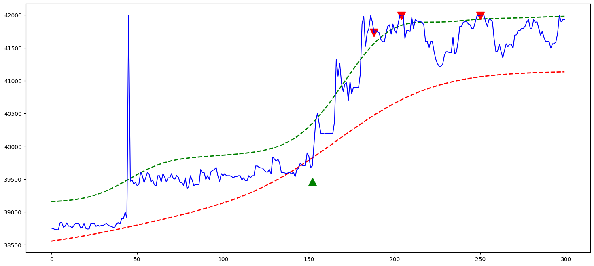

# Nadaraya Watson Binance Trading Bot

A sophisticated automated trading bot for Binance Futures that combines multiple technical analysis indicators to generate trading signals for BTCUSDT. The bot uses both Exponential Moving Average (EMA) crossovers and Nadaraya-Watson estimator signals to make trading decisions.

## 🚀 Features

- **Multi-Indicator Strategy**: Combines EMA crossover and Nadaraya-Watson envelope signals
- **Automated Position Management**: Automatically opens, closes, and switches positions based on signals
- **Risk Management**: Built-in position tracking and order management
- **Binance Integration**: Direct integration with Binance Futures API
- **Testnet Support**: Safe testing environment before live trading
- **Background Execution**: Can run continuously in the background
- **Error Handling**: Robust error handling for network timeouts and API errors

## 📁 Project Structure

```
TestBot/
├── config.ini                 # Binance API credentials configuration
├── Background.py              # Background execution with command-line interface
├── Nadaraya_Zeta.py          # Nadaraya-Watson estimator implementation
├── Position.py               # Position tracking utilities
├── output.png                # Generated chart output
├── Indicator/
│   ├── Main.py               # Main trading execution logic
│   ├── Exponential.py        # EMA crossover indicator
│   └── Nadaray.ipynb        # Jupyter notebook for indicator development
└── README.md                 # This file
```

## 📊 Sample Chart Output



*Example visualization showing the Nadaraya-Watson envelope with upper/lower bands and trading signals on BTCUSDT 15-minute chart*

## 🔧 Technical Indicators

### 1. Exponential Moving Average (EMA) Crossover
- **Short EMA**: 6-period EMA on close prices
- **Long EMA**: 21-period EMA on high prices
- **Signals**:
  - Signal 1 (BUY): Short EMA < Long EMA
  - Signal 2 (SELL): Short EMA > Long EMA

### 2. Nadaraya-Watson Estimator
A kernel regression-based smoothing technique that creates dynamic support and resistance levels:

- **Upper Band**: Uses open prices with bandwidth=18, multiplier=2.61
- **Lower Band**: Uses close prices with bandwidth=42, multiplier=1.5
- **Pivot Detection**: Identifies significant highs and lows with 15-candle window
- **Signals**:
  - Signal 1 (BUY): Price breaks below lower band at pivot low
  - Signal 2 (SELL): Price breaks above upper band at pivot high

## ⚙️ Configuration

### 1. Setup Binance API Credentials

Edit `config.ini`:
```ini
[binance]
key = 'your_binance_api_key'
secret = 'your_binance_secret_key'
```

### 2. Trading Parameters

Key parameters in the code:
- **Symbol**: BTCUSDT (configurable)
- **Quantity**: 0.149-0.200 BTC (varies by file)
- **Timeframe**: 15-minute candles
- **Data Limit**: 300 historical candles

## 🚀 Usage

### Method 1: Background Execution (Recommended)

```bash
# Start the bot on testnet
python Background.py --start --testnet

# Start with custom quantity
python Background.py --start --testnet --quantity 0.1

# Start on live trading (use with caution)
python Background.py --start

# Stop the bot
python Background.py --exit
```

### Method 2: Direct Execution

```bash
# Run the main trading logic
python Indicator/Main.py

# Test individual indicators
python Indicator/Exponential.py
python Nadaraya_Zeta.py
```

### Method 3: Jupyter Notebook Development

Open `Indicator/Nadaray.ipynb` for interactive development and visualization.

## 📊 How It Works

### Signal Generation Process

1. **Data Collection**: Fetches 15-minute BTCUSDT candles from Binance
2. **Indicator Calculation**: 
   - Calculates EMA crossover signals
   - Computes Nadaraya-Watson envelope signals
3. **Signal Combination**: Uses the Nadaraya-Watson signal as primary decision maker
4. **Position Management**:
   - Opens new positions when no position exists
   - Closes and reverses positions when signal changes
   - Waits for order fills before proceeding

### Trading Logic Flow

```
┌─────────────────┐    ┌──────────────────┐    ┌─────────────────┐
│   Get Market    │───▶│  Calculate       │───▶│  Generate       │
│   Data (15m)    │    │  Indicators      │    │  Trading Signal │
└─────────────────┘    └──────────────────┘    └─────────────────┘
                                                         │
┌─────────────────┐    ┌──────────────────┐    ┌─────────────────┐
│  Execute Trade  │◀───│  Check Current   │◀───│  Evaluate       │
│  (Buy/Sell)     │    │  Position        │    │  Position       │
└─────────────────┘    └──────────────────┘    └─────────────────┘
```

## 🛡️ Risk Management

### Built-in Safety Features

- **Testnet Mode**: Test strategies without real money
- **Position Tracking**: Prevents duplicate positions
- **Order Validation**: Confirms order execution before proceeding
- **Error Recovery**: Automatic retry on network timeouts
- **Limit Orders**: Uses limit orders instead of market orders for better fills

### Important Warnings

⚠️ **DISCLAIMER**: This is experimental trading software. Cryptocurrency trading involves substantial risk of loss.

- Always test on Binance testnet first
- Start with small position sizes
- Monitor the bot regularly
- Understand the strategy before using
- Never risk more than you can afford to lose

## 📋 Dependencies

```bash
pip install pandas numpy pandas-ta python-binance configparser matplotlib
```

Required packages:
- `pandas`: Data manipulation and analysis
- `numpy`: Numerical computing
- `pandas-ta`: Technical analysis indicators
- `python-binance`: Binance API client
- `configparser`: Configuration file handling
- `matplotlib`: Plotting and visualization (for Jupyter notebook)

## 🔍 Monitoring and Debugging

### Log Output
The bot provides real-time console output showing:
- Current position status
- Signal changes
- Order execution details
- Error messages and retries

### Position Checking
Use `Position.py` to manually check current positions:
```bash
python Position.py
```

### Signal Testing
Test individual indicators:
```bash
# Test EMA signals
python Indicator/Exponential.py

# Test Nadaraya-Watson signals
python Nadaraya_Zeta.py
```

## 🛠️ Customization

### Modifying Trading Parameters

1. **EMA Settings** (in `Exponential.py`):
   ```python
   emas_length = 6    # Short EMA period
   emab_length = 21   # Long EMA period
   ```

2. **Nadaraya-Watson Settings** (in `Nadaraya_Zeta.py`):
   ```python
   # Upper band (open prices)
   h = 18        # Bandwidth
   mult = 2.61   # Multiplier
   
   # Lower band (close prices)  
   h = 42        # Bandwidth
   mult = 1.5    # Multiplier
   ```

3. **Trading Symbol and Quantity**:
   ```python
   symbol = "BTCUSDT"     # Trading pair
   quantity = "0.149"     # Position size
   ```

### Adding New Indicators

1. Create indicator function in separate file
2. Import in `Main.py` or `Background.py`
3. Modify signal combination logic
4. Test thoroughly on testnet

## 📈 Performance Considerations

- **API Rate Limits**: Built-in delays prevent API rate limiting
- **Network Handling**: Automatic retry on connection issues
- **Memory Usage**: Efficient data handling with pandas
- **Execution Speed**: Optimized for real-time trading

## 🤝 Contributing

1. Fork the repository
2. Create feature branch
3. Test on Binance testnet
4. Submit pull request with detailed description

## 📄 License

This project is for educational purposes. Use at your own risk.

## 🆘 Support

For issues and questions:
1. Check the console output for error messages
2. Verify API credentials and permissions
3. Test individual components separately
4. Ensure sufficient account balance for trading

---

**Remember**: Always test thoroughly on testnet before live trading. Cryptocurrency markets are highly volatile and trading bots can lose money quickly if not properly configured and monitored.
